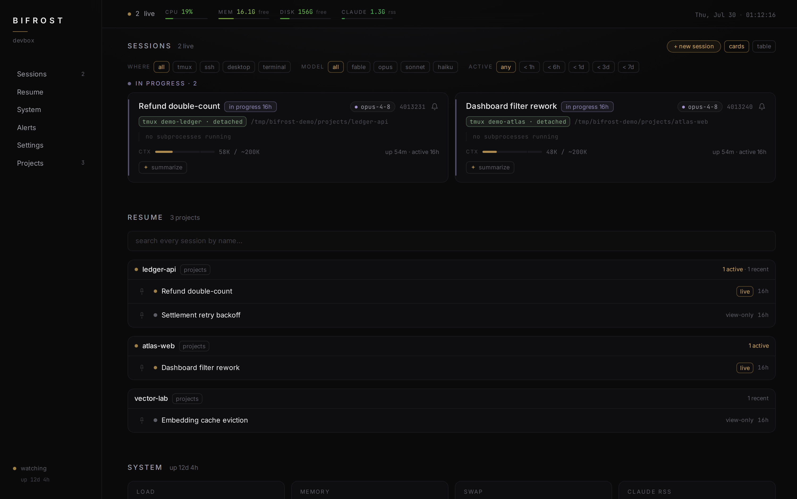
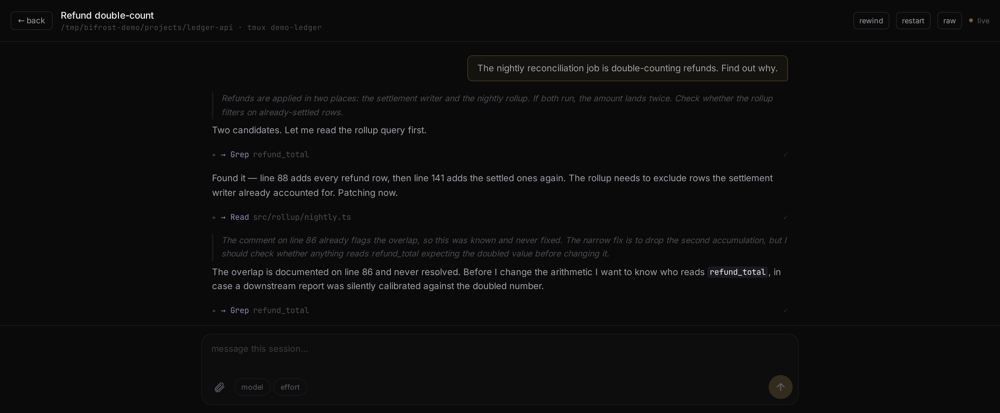
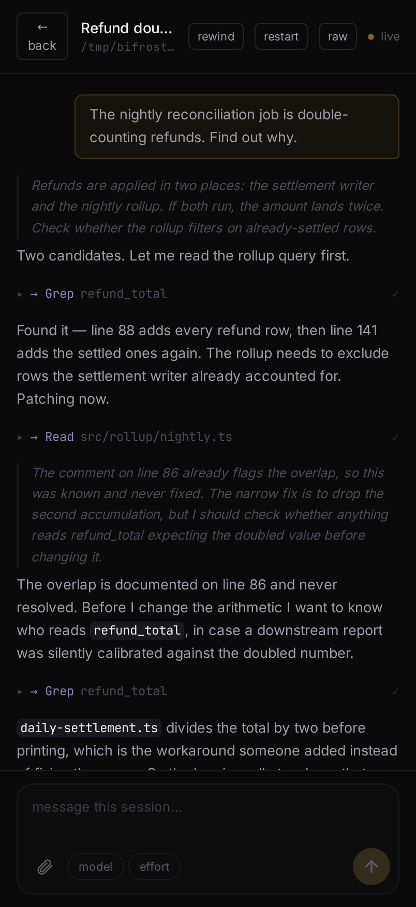

# Bifrost

[](https://github.com/timyjsong/bifrost/actions/workflows/ci.yml)

A self-hosted web dashboard for running [Claude Code](https://claude.com/claude-code) on a dev box. It shows every project and live session on the machine, and lets you start, resume, and drive sessions from any device on your private network — phone included.

Bifrost reads session transcripts and `/proc` directly, so it sees everything: interactive sessions, background agents, subprocess trees, context-window usage, system pressure. For interactive tmux sessions it goes further than watching — you can send prompts, answer permission menus, interrupt a running turn, switch model or effort, or open a live terminal mirror. Installed as a PWA, it sends a push notification when a session needs you; tapping it opens the exact session waiting for an answer.

I built it because I was driving Claude Code by sshing into a box and reattaching tmux from whatever device I had, which works badly from a phone. Bifrost is the interface I wanted instead.



## What's worth a reviewer's time

If you read three things here, read these:

- **The resume liveness gate** (`server/spawn/resume.ts`) — resuming a session that is actually live would put two writers on one transcript. So resume refuses to run without a *positive* not-live signal (quiescent transcript, no live pid, no owned tmux session), read fresh at click time rather than from the 3s snapshot, because a snapshot is a claim about the past.
- **The per-session spawn lock** (`server/spawn/registry.ts`) — every lifecycle path serializes under a lock that claims a pending slot *before* spawning, so a double-click gets a 409 instead of a second process.
- **A production failure whose failure mode was "returns empty"** — a tmux upgrade silently disabled the headline feature on my own box, and nothing threw. What it cost and what it changed is in [Status](#status).

## Features

**Sessions.** Every session on the box appears as a card or table row with its activity state (`needs you` / `approval` / `paused` / `working`), derived from the transcript tail and cross-checked against `/proc`. Cards show where the session lives (tmux / ssh / desktop), which model it runs, and a context-window gauge that tracks model switches — when the window size is a guess rather than a measurement, the gauge says so. Fan-out agents and background tasks are attributed to their owning session by matching transcript tool calls against live process command lines; work that detached from its parent process is recovered through task-output file descriptors. Filters (residence, model, activity) narrow the board.

**Session lifecycle.** Start a fresh session in any project directory, resume an inactive one, or restart a live one — from the dashboard, without touching a terminal. Origination picks a directory through a confined browser and a model from an allowlist, then launches into a new interactive tmux session. Resume refuses to run until it has a *positive* signal that the session is not already live (quiescent transcript, no live pid, no owned tmux session), read fresh at click time rather than from the tick snapshot, because resuming a live session would put two writers on one transcript. Everything is serialized per session under a lock that claims a pending slot before spawning, so a double-click gets a 409 instead of a second process. Restart confirms before killing, since killing loses in-flight turn state.

**Drive.** Open a session and the conversation renders live over SSE, with collapsible tool calls and markdown. Typing is local and instant; drafts sync across devices; sending has a short grace window during which you can cancel. Interrupt sends Esc — never Ctrl-C, which would kill the session. When Claude shows a permission menu, Bifrost parses it from the pane and renders answer buttons; if the parse isn't confident, it shows the raw pane instead of guessing, because a silently wrong answer is worse than no answer. Model, effort, and rewind are driven through the real TUI pickers: the options are read from the live pane, then the picker is released immediately, so backing out never leaves a session sitting at a prompt. There is also a slash-command suggester, a permission-mode toggle, file attach, and a read-only xterm.js terminal mirror as the fallback for anything the structured view can't handle.



The same session from a phone — the form factor the whole thing was built for:



*(Screenshots are taken against a demo fixture, not my own box.)*

**Alerts and push.** A signal engine derives 13 tunable signals (session waiting, approval needed, memory pressure, service down, and so on) and maps them to Web Push notifications, which work away from your network. Session alerts deep-link into the drive view. Which units get watched is configuration, and an unconfigured install watches nothing rather than alerting about services it invented.

**Search and history.** Sessions are indexed mtime-first and persisted across restarts, so a cold start doesn't re-parse the whole transcript pile. Searching by name filters the full uncapped set in memory on every keystroke — no I/O, so it runs as you type. Searching by *content* is a separate path: `grep -rilF` names candidate transcript files, then the newest candidates are scanned in-process for a readable snippet, and a hit only counts if the term appears in conversation text rather than buried in a tool payload. There is no search index and no database — the JSONL corpus is the store. Pinning keeps a session surfaced past the history cutoff.

**Summaries.** One click summarizes a transcript using a background Claude session. A queue sized from the memory ceiling the jobs actually run under keeps concurrent jobs bounded; results are cached until the transcript changes.

**Projects and files.** Project cards show branch, dirty state, and recent activity for each configured directory. A read-only file browser confines every request to a project root via realpath — path traversal and symlink escapes resolve outside the root and are rejected.

**Auth.** Enrollment is a QR code carrying a single-use, time-limited code, minted from a CLI on the box. Devices trade it for a 256-bit token checked in constant time. Guessing is throttled per IP. Host and origin allowlists block DNS-rebinding and CSRF, and every response carries a CSP. Revoking a device blocks its next request immediately; an SSE stream it already has open is cut on the following heartbeat, so worst case it sees another 25 seconds of events.

## Design constraints

- **No headless Claude.** Bifrost never invokes `claude -p` or the Agent SDK (a hard project constraint — programmatic usage bills separately). It observes through disk and `/proc`, and interacts by injecting keystrokes into existing interactive sessions through tmux. Starting a session means launching a real interactive session in tmux, never a headless one. The one exception: summaries start an interactive-class background session, and only when you click.
- **Latency lives in transport, not interaction.** Input echoes locally and is sent on commit; keystrokes never cross the network one at a time.
- **Single user, private network.** Bifrost binds a private interface (a Tailscale IP, a LAN address) and is not meant to face the internet. Auth exists so that a lost phone is not a lost box.
- **No database.** One Bun process. Everything is read live from disk and `/proc` with mtime-keyed caches.

## Architecture

```
server/                Bun + TypeScript (run natively, no build step)
  index.ts             HTTP + SSE + static serving of web/dist; route handlers
  routes/              the API surface as data + the pure route matcher
  collectors/          sessions (transcripts + /proc), projects (git), system,
                       persisted mtime-first session index
  drive/               transcript parser, tmux send + target validation,
                       permission-menu parser, model/effort/rewind pickers,
                       diffs, drafts, slash scan, uploads
  spawn/               originate / resume / restart, spawn registry with a
                       per-session lock, memory gate, confinement
  lifecycle/           idle-park sweeper (ships disarmed)
  search/              grep-backed conversation-content search
  sessions/            pins and history-cutoff bypass
  alerts/              signal derivation, alert engine, Web Push, VAPID keys
  auth/                request guard, tokens, enrollment, throttle + CLI
  files/               realpath-confined read-only browser
  testing/             temp-dir helper the suite sweeps on teardown
web/                   Vite + React 19 + Tailwind v4 SPA
shared/                the Snapshot type + the alert-signal catalog, both sides
phases/                the design docs each build was greenlit against
deploy/bifrost.service systemd unit
```

- **Fast tick (3s):** sessions + system → snapshot → pushed to browsers over SSE.
- **Slow tick (30s):** project/git scans + transcript-index sweep.
- Session presentation is swappable: `web/src/lib/selectors.ts` shapes the data and `web/src/views/sessions/` holds the views behind a registry. A new view is one component and one registry entry.

## Tests

`bun run check` runs the unit suite plus server and web typechecks; CI runs it on every push, so the badge above is the current answer. This file deliberately no longer repeats the count: the last two revisions of this paragraph each shipped a number that was already stale by the time it was committed.

The tests cover the logic layer: transcript parsing, state derivation, process attribution, tmux target validation, menu parsing, spawn confinement and the resume liveness gate, picker option matching, the summarize queue, auth, window resolution, filters, and view models. They are written from the requirement, not the implementation — a failing test means the behavior changed, not that the test needs updating.

**Coverage, stated plainly: `bun test --coverage` reports 89%, and measured against the whole tree it is closer to 52%.** Bun only instruments files a test actually imports, and 37 source files totalling about 7,700 lines are imported by no test at all — they never enter that denominator. The largest single absence is `server/index.ts`: 1,437 lines holding every API handler, loaded by nothing.

What the 89% describes is real, and it is concentrated where the security and correctness decisions live — `auth/guard.ts`, `auth/tokens.ts`, `derive.ts`, `files/confine.ts` and the spawn modules are at or near 100%. It thins out fast in the plumbing, and there are no component tests at all. The pattern is that the *decisions* are tested and the *plumbing* mostly isn't: a defensible place to be while shipping, and an indefensible place to stay. The file-by-file distribution, what closed since the last revision, and what is honestly next are in [docs/coverage.md](docs/coverage.md).

## Requirements

- Linux (Bifrost reads `/proc`)
- [Bun](https://bun.sh)
- tmux, for driving and starting sessions
- Claude Code installed and used on the same box
- A private network to serve on — a Tailscale tailnet, VPN, or LAN

## Run

```sh
cp bifrost.config.example.json bifrost.config.json
# edit: bind host, realms (project dirs), auth allowlists

bun install
cd web && bun install && bun run build && cd ..   # build the frontend once

bun server/index.ts        # serve API + frontend
bun run enroll             # mint a QR enrollment code for your first device
```

For frontend development: `cd web && bun run dev` proxies `/api` to the running server (override the target with `BIFROST_DEV_PROXY`).

The example config binds `127.0.0.1`, which is the safe default but only reachable from the box itself — point `bind.host` at your private interface once you have the allowlists right. Those `auth.origins` / `auth.hosts` allowlists must match the exact host you browse to, or every request is denied; that is the fail-closed default, and it is the first thing to check if the UI loads but every request 403s. `auth.enrollUrl` is the address the QR code points new devices at; if you want push notifications and camera-based QR enrollment on iOS, that address needs HTTPS (for example via `tailscale serve` or a local Caddy in front). Only an `https://` enrollUrl is treated as a secure origin.

Environment overrides: `BIFROST_CONFIG` (config path), `BIFROST_DATA_DIR` (token/alert storage, default `data/`), `BIFROST_VAPID_SUBJECT` (contact address in Web Push headers).

## Deploy as a service

The repo ships a systemd unit. Edit `deploy/bifrost.service` first — set `User`, `Group`, `WorkingDirectory`, and the `bun` path in `ExecStart` to match your box — then:

```sh
sudo cp deploy/bifrost.service /etc/systemd/system/
sudo systemctl daemon-reload
sudo systemctl enable --now bifrost
sudo systemctl status bifrost
```

Server code changes need a service restart. Frontend changes only need `cd web && bun run build` — the running server picks up the new bundle.

One knob is easy to get wrong, so it's worth stating: the unit's `MemoryMax` has to cover Bifrost *and* its summarize jobs, because those run as direct child processes and stay inside the service's cgroup. Sessions you start from the dashboard don't count against it — they launch inside tmux and belong to the tmux server instead. Size it as Bifrost (~150 MB) plus `summarize.maxInFlightCap × summarize.perJobMb`; the shipped defaults are 4 × 250 MB against a 2 GB cap. Raise either knob and raise the cap with it, or a summarize job will be OOM-killed inside the cgroup — and the kernel may pick Bifrost as the victim instead of the job.

## How it was built

I specced each build before it was written, agreed the acceptance criteria up front, then reviewed the result until it converged. Every cycle ships contract tests for the logic it added.

That work is readable rather than asserted. The specs are in [`phases/`](phases/), including what was considered and rejected; the red-team findings for Build 2 are folded into [`phases/02-start-restart.md`](phases/02-start-restart.md); the concurrency invariant that governs resume is stated at the top of `server/spawn/resume.ts` and implemented against; and the threat model for publishing this repo at all is encoded as an executable control in `server/placeholders.test.ts`, along with the list of classes that got past earlier versions of it.

The implementation ran autonomously in Claude Code sessions, and every commit carries a co-author trailer to say so. What this repository evidences is the part that was mine — deciding what to build, specifying the contracts, red-teaming the designs before they were built, and reviewing what came back — and not implementation throughput. Read it as a record of engineering judgment, not as a code sample.

**How this history relates to the real one.** Bifrost is developed in a private repository and published here as a filtered extraction: internal working notes, a build-state log, ticket files and audit write-ups are excluded, and machine identifiers are replaced with placeholders. `server/placeholders.test.ts` enforces that over published history rather than just the working tree — home paths in both spellings, tailnet hosts, addresses in the CGNAT range, e-mail, the OS username, session ids and their fragments, and any fixture name matching a real directory on the machine it was published from. It is a list of modelled classes, not a proof that nothing was missed; six review passes each found a class it did not yet cover, and each one is in there because it got through. Two consequences are visible from the outside and worth naming rather than leaving you to trip over them. A few early commit messages mention files you won't find in their diffs, because those files were filtered out of the published history. And Build 2 lands as one large commit instead of the per-milestone series Builds 0 and 1 got — it was extracted in a single pass, not written in one sitting, and its design doc predates its code by weeks even though the commits arrive in the opposite order.

A third is worth explaining before you read it as something else. Many commits dated 2026-07-30 have subjects about scrubbing identifiers and hardening a guard — catching session ids, stopping the guard exempting itself, scanning published history rather than the index. Those commits are the construction of `server/placeholders.test.ts`, roughly one modelled class each. Every class is in that file because it got past the version before it: the guard was built by attacking it and fixing what got through, not by reasoning about what might. That is why the list is long, and why the test's header reads like a list of failures — it is one.

## Status

In daily use on my own box: the observe layer, driving existing tmux sessions, and the alert/push layer are all shipped and converged.

With one caveat I'd rather state than have you find in the log. Driving converged in June and then silently stopped working on my own box after a tmux upgrade. tmux 3.6 replaces control characters with `_` in `-F` format output, and both tmux collectors used a tab as their field separator — so every row came back as one unsplittable field, both parsers returned zero rows, no process ever matched a pane, and every session read as "not tmux-resident." Nothing threw. The dashboard just quietly fell back to view-only and the System pane showed no tmux sessions. I caught it on 2026-07-30 while taking the screenshots above, because one of them showed that message on a session that obviously was tmux-resident. Fixed by moving to a separator tmux cannot mangle, with tests that pin the delimiter contract and carry the mangled line as a fixture. The lesson I'd take from it is that an integration whose failure mode is "returns empty" needs a test that would notice empty, which is now what those tests are.

Session lifecycle — originate, resume, restart — is **built and green but its review cycle is still open**. The flows work and are covered by tests; what has not happened is my own final sign-off pass over them, so I am not calling that build converged. [`phases/02-start-restart.md`](phases/02-start-restart.md) says the same thing at the top of the file.

Idle-park (`lifecycle/`) ships disarmed: the sweeper is implemented and observable, but killing idle sessions is off by default and gated behind config.

## License

MIT
